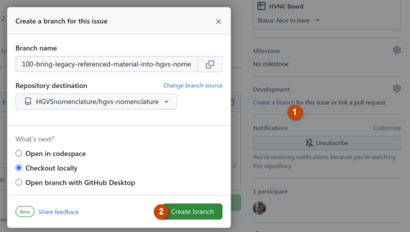
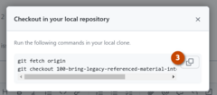

# HGVS Nomenclature

This repo contains the source code for the HGVS Nomenclature, which is maintained by the Human Genome Organization Variation Nomenclature Committee (HVNC).

This page is intended for writers, editors, and contributors to the HGVS Nomenclature. **Most readers of the HGVS Nomenclature should see https://hgvs-nomenclature.org/.**

## Availability

The [code repository](https://github.com/HGVSnomenclature/hgvs-nomenclature/) from which the HGVS Nomenclature is rendered contains both written text recommendations and associated code. The licensing for each is as follows:

* Text describing the HGVS Nomenclature is released under the [CC0 1.0 Universal (CC0 1.0) Public Domain Dedication](https://creativecommons.org/publicdomain/zero/1.0/). See the [`LICENSE-CC0.txt`](LICENSE-CC0.txt) file for details.
* Code, configuration files, and other computer-readable artefacts in the code repository are released under the [MIT License](https://opensource.org/licenses/MIT). See the [`LICENSE.txt`](LICENSE.txt) file for details.

## Contributing

The HGVS Nomenclature pages are written in Markdown and formatted into static HTML using mkdocs. This process is easily setup locally for real-time visualization of edits, and it is also implemented on readthedocs.com, where the pages are hosted.

### Setting Up

You must have Python installed on your machine and be able to create a virtual environment.

    python3 -m venv venv
    source venv/bin/activate
    pip install -r requirements.txt
    pre-commit install

### Running mkdocs locally

    $ mkdocs serve
    INFO     -  Building documentation...
    INFO     -  Cleaning site directory
    INFO     -  Documentation built in 0.67 seconds
    INFO     -  [22:51:33] Watching paths for changes: 'docs', 'mkdocs.yml'
    INFO     -  [22:51:33] Serving on http://127.0.0.1:8000/

Now navigate to the URL shown above. mkdocs is now watching for changes in the documentation directory. Any changes made will trigger pages to be rebuilt and reloaded by your browser.

### Making changes

If your work is related to an issue, please use GitHub to create a branch that is linked to the issue:

Alternatively, `gh issue develop <issue#>` if you have the gh cli installed.

Then make your changes, commit, and push like this:

    git commit -m "<your commit message>"
    git push

Then go to https://github.com/HGVSnomenclature/hgvs-nomenclature and submit a pull request for these changes.
