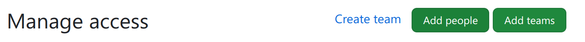
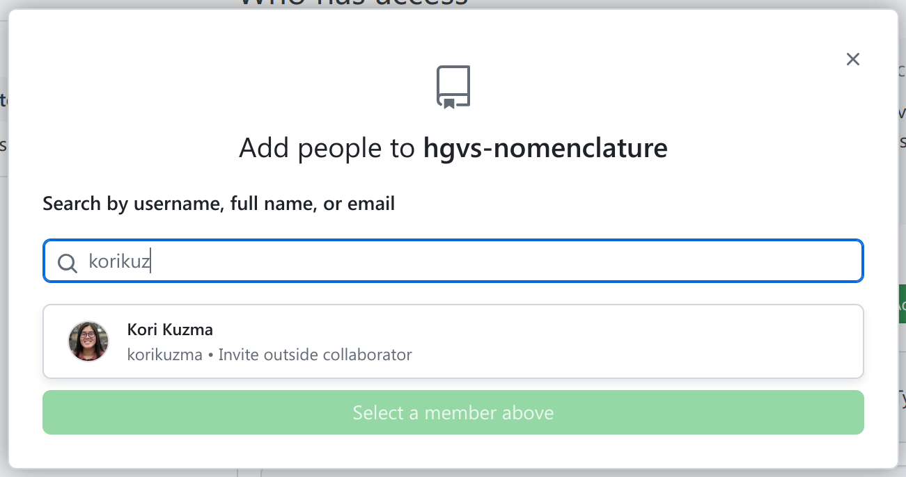

# Adding People to HGVS Nomenclature

This document describes how to add people to the hgvs-nomeclature website team.
You will need to be a repo administrator to use these instructions.

## Who needs access?

**Add only users who have a role in the maintainance or administration hgvs-nomenclature.**

hgvs-nomenclature is a public repo. Anyone with a GitHub account may fork the repo, submit pull requests against it, and create or comment on issues and discussions. Public access should be the default mode for most individuals because it's safer and requires no maintainance.

Conversely, anyone who has a privileged role will need to be added invdividually to the repo as described below.  Such users will have one of these roles:

- Triage: Contributors who need to manage issues, discussions, and pull requests without write access
- Write: Contributors who actively push to your project
- Maintain: Project managers who need to manage the repository without access to sensitive or destructive actions
- Admin: People who need full access to the project, including sensitive and destructive actions like managing security or deleting a repository

## Instructions

1. Navigate to https://github.com/HGVSnomenclature/hgvs-nomenclature/settings/access

1. Click Add People

1. Search for the user you want to add. It's best to ask for the user's GitHub username beforehand so that you add the right person.

1. Select the role you want the user to have.  (You should never need to add the Read role because everyone has that by default.)

