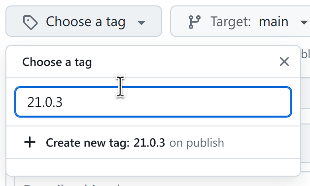

# How to release a new version of HGVS Nomenclature

This document describes how to release a new version of hgvs-nomenclature.org.  You must be a repo maintainer to use these instructions.

## What's a release?

A release is made by tagging the repo with a version tag of the form x.y.z (with no v. prefix).  That operation alone is sufficient to cause Read the Docs to rebuild the documentation as that version *and* to update the `/stable` link (i.e., https://hgvs-nomenclature.org/stable/).

At the same time, the maintainer should create release notes.  We currently have
two release notes: the major release notes at
https://hgvs-nomenclature.org/stable/versions/ and the patch-level release notes
at https://github.com/HGVSnomenclature/hgvs-nomenclature/releases/. **We should
reconcile these and our process for maintaining them.**  For these instructions,
we'll update just the GitHub release notes.

## Instructions

1. Navigate to https://github.com/HGVSnomenclature/hgvs-nomenclature/releases.

1. Click **Draft a new release**.

1. Click Choose a tag and type the next tag.  See https://hgvs-nomenclature.org/stable/versions/ for our versioning policy.

1. Click **Generate release notes**. Proofread and edit the notes as you like.

1. Click **Publish release**.

## Notes

- Here's how Reece fetches the release notes:

`curl -s https://api.github.com/repos/HGVSnomenclature/hgvs-nomenclature/releases/tags/21.0.3 | jq -r .body`

We need to update these instructions to account for adding release notes. It's a bit tricky because we ideally want the release notes in the release *before* tagging, which makes the above command not work.
